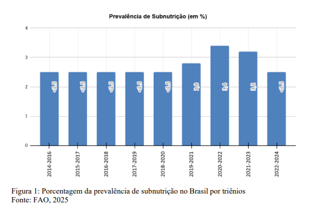
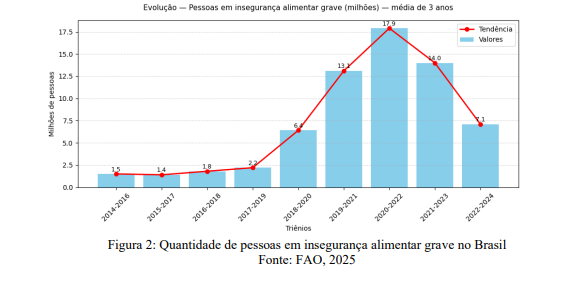
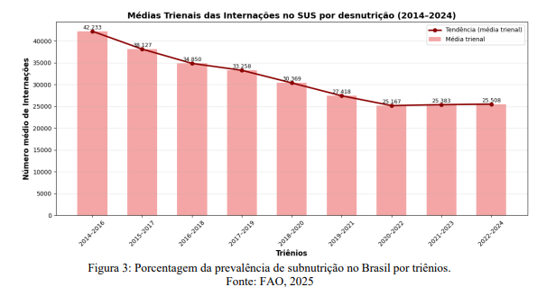

# 🍽️ Insegurança Alimentar no Brasil: FAO x SUS (2014–2024)

Projeto de análise de dados que investiga a relação entre a insegurança alimentar severa no Brasil, medida pela FAO, e as internações por morbidades nutricionais registradas no SUS (DATASUS), no período de 2014 a 2024.

## 📊 Visão geral do estudo

O trabalho cruza séries temporais da FAO (insegurança alimentar severa, em milhões de pessoas por triênio) com dados do DATASUS sobre internações por desnutrição (CID-10 E40–E46), agregados em médias trienais para tornar os indicadores comparáveis. O foco é entender o que aconteceu durante os anos da pandemia de COVID-19, quando o Brasil voltou ao “Mapa da Fome” ao mesmo tempo em que os registros clínicos de desnutrição caíram.

## 🎯 Pergunta central

A pergunta que orienta o projeto é:  
“Como a evolução da insegurança alimentar severa no Brasil, reportada pela FAO, se relaciona com as internações por desnutrição registradas no SUS entre 2014 e 2024, especialmente durante a pandemia de COVID-19?”

## 🛠️ Metodologia de análise

- Extração de dados:
  - FAO/FAOSTAT: população em condição de insegurança alimentar severa, em milhões de pessoas, por triênios.
  - DATASUS: internações hospitalares por desnutrição (CID-10 E40 a E46), de 2014 a 2024.
- Tratamento:
  - Agregação dos dados anuais do SUS em médias trienais para alinhar à periodicidade da FAO.
  - Análise descritiva e exploratória com Python (Pandas, NumPy, Matplotlib, Seaborn).
- Estatística:
  - Cálculo da correlação de Pearson entre a série de insegurança alimentar severa (FAO) e a série de internações por desnutrição (SUS).

## 📈 Principais resultados

- Os dados da FAO mostram um aumento expressivo da insegurança alimentar severa nos triênios que incluem os anos da pandemia, com a proporção da população em fome severa saltando de 6,4% (2018–2020) para 17,9% (2020–2022).
- Paralelamente, as internações por desnutrição no SUS apresentam tendência continuamente decrescente ao longo de todo o período, inclusive nos anos em que a fome mais aumenta.
- A correlação de Pearson entre os dois indicadores é forte e negativa (r = -0,856), indicando que, enquanto a insegurança alimentar cresce, os registros clínicos de desnutrição caminham na direção oposta.

## 🔍 Interpretação dos gráficos

- (prevalência de subnutrição, FAO): evidencia o retorno do Brasil ao Mapa da Fome a partir do triênio 2019–2021, com patamares de subnutrição mais altos nos triênios pandêmicos.
  

- (pessoas em insegurança alimentar grave): mostra o pico de pessoas em situação de fome severa, atingindo valores históricos durante 2020–2022.
  

- (internações por desnutrição – SUS): revela uma trajetória de queda nas médias trienais de internações, mesmo quando a insegurança alimentar está em alta.
  

Essa combinação de curvas (FAO em alta x SUS em queda) reforça a hipótese de subnotificação importante de casos clínicos de desnutrição durante a pandemia.

## ⚠️ Limitações discutidas no artigo

- Dados da FAO em triênios, o que reduz a granularidade temporal e pode esconder variações anuais ou sazonais.
- Subnotificação clínica e epidemiológica já documentada para a COVID-19 e outras doenças (como dengue e tuberculose), o que sugere cenário semelhante para a desnutrição.[file:33]
- Uso de interpolações em alguns pontos das séries, introduzindo margens de estimativa nas análises.

## 🚀 Como reproduzir os códigos

1. Acesse o arquivo Google Colab e tenha acesso aos códigos e gráficos:
https://colab.research.google.com/drive/1uy7zoTf4j0v68z-3ifGHRfmpJtwX7DUV?usp=sharing

Obs: Caso queira baixar ou conferir os dados originais:
- FAOSTAT (FAO) – indicadores de segurança alimentar: https://www.fao.org/faostat/en/#data/FS
- DATASUS – internações hospitalares por CID-10: https://datasus.saude.gov.br/

## 👥 Autores

Rafael de Gino Barbosa  
Rodrigo Santos dos Santos

Projeto acadêmico de Análise de Dados sobre insegurança alimentar, morbidades nutricionais e qualidade dos sistemas de informação em saúde no Brasil.
